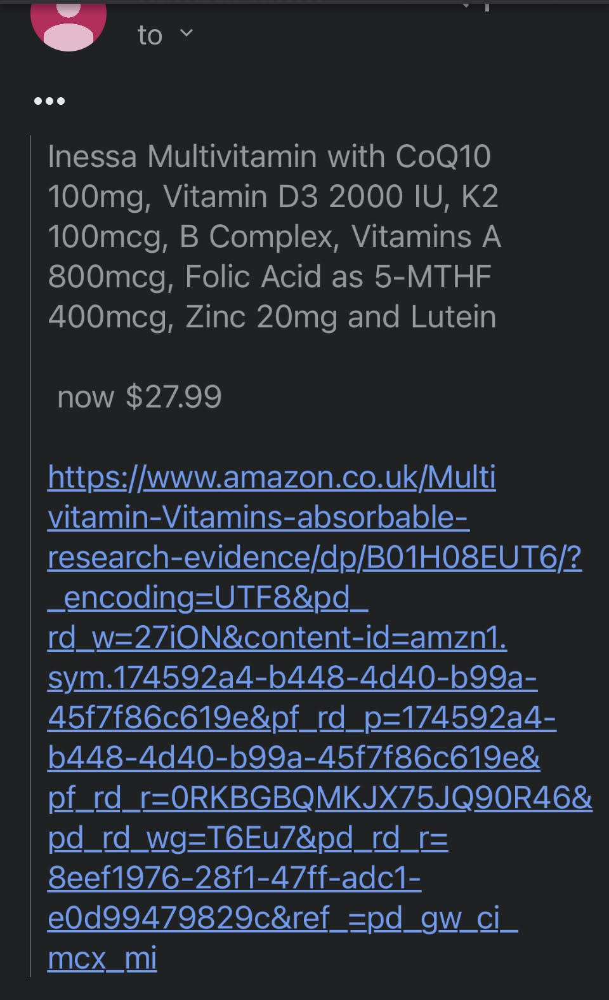

## Super Price Spyder 

Super Price Spyder is a simple Python program designed to scrape the Amazon website for product pricing information. It uses the requests library to make an HTTP request to the provided URL and parses the page data with BeautifulSoup library. It then compares the current price to a specified threshold value and, if it is lower than that value, sends an email notification with details of the product to the user's email address. 

## Requirements 

The program requires both the requests and BeautifulSoup libraries, as well as the os library to get environment variables. It also uses the smtplib library to send an email notification, and needs an email address with password to do so. 

## Usage 

To run the program, simply set the `url` variable to the target product’s Amazon URL, enter your email address as the `my_email` variable and your password as the `password` variable in the os environment. Lastly, set the `threshold` value to the price level you wish to receive notifications for and run the program. The program will print the title, price and URL of the product on the console, along with a notification message sent to the user’s email address. 

